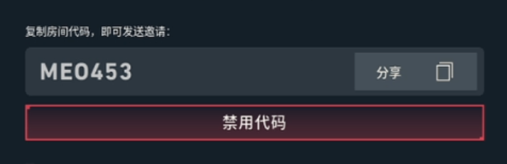
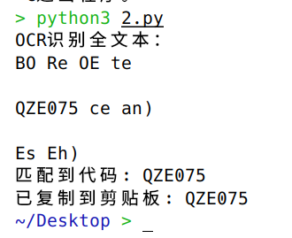

# README

## 启动

双击.py文件即可

## 依赖

- Python3.7以上

- pillow

- pytesseract

- pyperclip

- ```bash
  pip install pillow pytesseract pyperclip
  ```

- Tesseract-OCR

  > [!NOTE]
  >
  > 如果安装路径选择了非默认，需要再代码加上
  >
  > import pytesseract
  > pytesseract.pytesseract.tesseract_cmd = r"C:\Program Files\Tesseract-OCR\tesseract.exe

## 使用方式

双击启动后，将自动截取整个屏幕，手动框出识别范围，包含房间码，可稍大于房间码，如下图：

识别成功后会直接将6位房间码复制，直接黏贴即可。

## 运行截图



## 声明

本脚本大部分为Copilot所为。